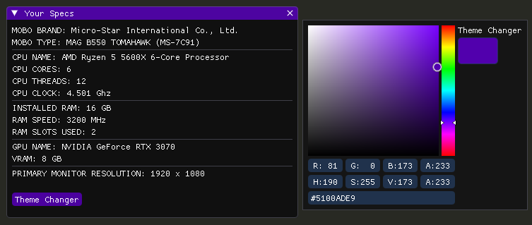

# SpeccyGUI
This is simply a dumbed down version of speccy that gives the basic and important info's of your system specs, theme will update live and save

this is written in c#/.net  with the ImGUI.NET library

 This should work with Nvidia/AMD/Intel GPU's, but only nvidia is tested

**THIS USES THE FOLLOWING LIBRARIES TO HELP ACHIEVE ITS FUNCTIONALITY:**

- ClickableTransparentOverlay & ImGUI.Net (for the menu/overlay)
- Fody / Costura Fody (to pack the libraries & packages inside the .exe and keep it clean)
- LibreHardwareMonitor & SharpDX / SharpDX.DXGI (to retreive some values about the hardware)
- Newtonsoft.JSON (for handling config file / JSON deserializing)

$${\color{red}Currently \space the \space space \space the \space UI \space is \space rendered \space in \space is \space grabbed \space from \space primary \space screen \space (this \space is \space also \space whats \space reflected \space as \space 'primary \space monitor \space resolution' \space on \space the \space UI, \space because \space of \space this \space it \space may \space have \space problems \space with \space multiple \space monitors- \space specifically, \space you \space may \space not \space be \space able \space to \space move \space the \space UI \space outsize \space the \space zone \space of \space the \space main \space monitor, \space i \space do \space not \space care \space to \space fix \space this \space problem, \space u \space can \space change \space it \space with \space the \space source.rar \space above \space if \space you \space know \space what \space you \space are \space doing}$$

